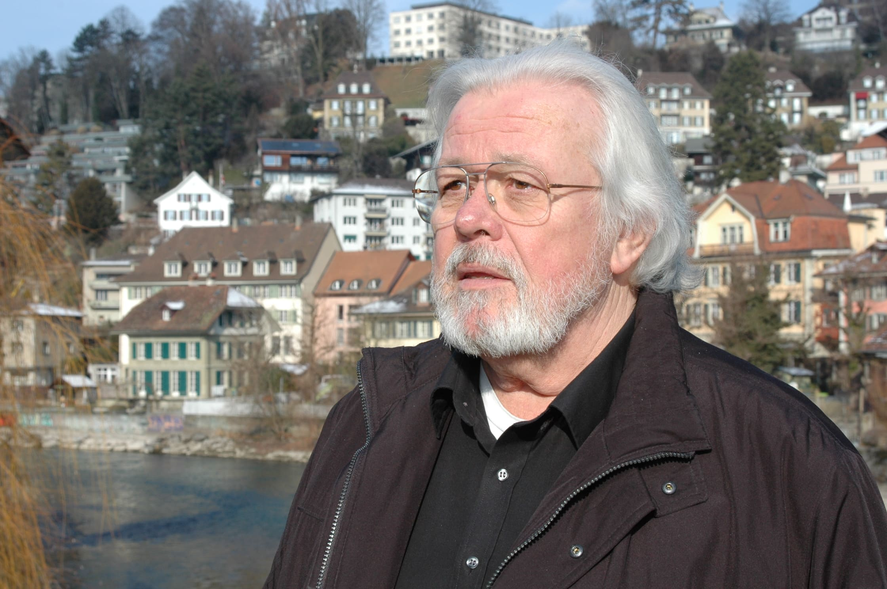

+++
title = "Interview"
date = "2024-03-12"
draft = false
pinned = false
+++
## "Den Lehrern wurde verboten, den wüsten Dialekt in der Schule zu gebrauchen"



Die Matte birgt viele Geheimnisse. Dank dem Mätteler Peter Hafen konnte ich einem etwas näher kommen, dem Matteänglisch. Warum der Stadtdoktor zum Verschwinden beitrug und wie der Mätteänglisch-Club entstand, erschliesst sich aus diesem Interview. 





Der Präsident des Berner Matteänglisch-Club und CO-Autor des Buches "Matteänglisch" gibt alles, um die Sprache zu erhalten. Mit regelmässigen Vorträgen, Höcks des Clubs und die Bereitschaft Interviews für (Matura-) Arbeiten zu geben, trägt er zum Erhalt bei.



> Es gibt eine Menge Gerüchte und Vorstellungen.

#### **Kennt oder besser gesagt erkennt man den das Matteänglisch?**

Manchmal, aber nicht wirklich. Man muss die Menschen schon darauf aufmerksam machen. Es gibt eine Menge Gerüchte und Vorstellungen. Es wird automatisch mit dem Armenquartier von 1191 verbunden. 

#### **Bist du in der Matte aufgewachsen?**

Nein. Aber mein Urgrossvater und mein Grossvater. Mein Vater nur noch zu einem Teil und ich selbst nur noch zu einem kleinen Teil. Mein Grossvater eröffnete später im Altenberg ein Geschäft, aber ging, wie mein Vater, hier in der Matte zur Schule. So blieb der Kontakt in die Matte. 
Ich bin also dennoch ein Mätteler, ein akzeptierter. Denn früher musste mindestes der Grossvater in der Matte gelebt haben, um als Mätteler zu gelten.

> Ich bin also dennoch ein Mätteler, ein akzeptierter.

#### **Wie bist du dann zur Sprache gekommen?**

Mein Vater benutze ab und zu Ausdrücke und auch in der Umgebung bekam ich es mit. Ausserdem bin ich im Kirchenfeld zur Schule, wo auch die aus dem Marzili hinkamen. Die haben natürlich den Mattendialekt gesprochen und so gehöre ich noch zu jenen, die den Mattedialekt sprechen. Obwohl mein Passiv-Wortschatz natürlich grösser ist als der aktive. 

#### **Es besteht also ein Unterschied, zwischen dem Matteänglisch und dem Mattedialekt?**

Ja, das ist ein lebhafter Unterschied. Der Dialekt ist eine Entwicklung und das Matteänglisch hat ein System. 

#### **Wie kam es dann dazu, dass die Sprache verschwand?**

Die Sprach hatte ihre Wellen. Um die Jahrhundertwende 1910, fand der damalige Stadtdoktor heraus, dass man in den Häusern der Badgasse nicht mehr wohnen kann. Man wurde darin krank und so mussten die Menschen darin fortjagen, um neue Häuser zu bauen. Die Menschen zogen weg von der Matte, in den Breitsch oder nach Bümpliz. So gab es also nur noch wenige, die die Sprache konnten und man brauchte es immer wie weniger. 
Im Zweiten Weltkrieg jedoch legte man wieder Wert darauf, ein richtiger Schweizer zu sein. Hier in der Matte besonders. 

> Man wurde darin krank und so mussten die Menschen darin fortjagen, um neue Häuser zu bauen. 

Nach dem Krieg wurde alles internationaler. Den Dialekt und das Matteänglisch verstand man nicht mehr und es wurde wieder nicht gebraucht. Ausserdem wollten die Jungen lieber ihre eigene Geheimsprache entwickeln, welche nicht lange andauerte, als das Matteänglisch weiterzuführen. 

#### **Woran bemerkte man das Verschwinden?**

Das haben die Mätteler hier unten bemerkt und beschlossen, dass sie etwas dagegen tun müssen. 

> Einer der Mätteler ging voran und die anderen machten mit.

#### **Entstand so der Matteänglisch-Club?**

Ja. Einer der Mätteler ging voran und die anderen machten mit. Nach 10 Jahren kam dann das erste Buch heraus, welches wir bis vorletzt noch gebraucht haben. Verschiedene Leute aus der Matte haben Geschichten und Artikel geschrien, welche im Buch zusammengefasst wurden. 

#### **Ich bemerke hier in der Matte eine andere Stimmung als in der Oberstadt. Nimmst du das auch so wahr?**

Ja, schon. Es wechselt zwar, ein Generationenwelchsel. Es kommen immer mehr Leute mit der romantischen Vorstellung gegenüber der Lage am Wassers nach unten. Sie renovieren die Häuser und sind glücklich, dass sie hier schlafen können. 
Die alten Originalmätteler sind, bis auf vereinzelte, weg. Aufgrund der früheren und schwierigen Zeiten hatten diese einen starken Zusammenhalt. Heute findest du sie aber oben in der Stadt und nicht mehr in unseren 5 Beizen. Die, die die Beizen füllen sind von der Oberstadt.

#### **Ein Grund mehr, warum die Sprache verloren geht, oder?**

Ja, das sowieso! Es gibt aber noch die sogenannten Heimwehmätteler. Sie treffen sich einmal im Monat, früher im Wöschhüsi, heute im Suresh. Und da kann es durchaus plötzlich passieren, dass ab und Matteänglisch gesprochen wird, aber mehr Mattedialekt.

#### **Gibt es den noch viele, die das Matteänglisch sprechen?**

Man findet ab und zu Menschen, die es noch sprechen. Sogar ganze Familien, die familienintern das Matteänglisch als Tradition weiterführen! Wir wissen nicht wie viele, aber es gibt sie. Da war sogar einmal eine Polizistin aus einer solchen Familie, die es konnte. Und die Stadträtin konnten wir ebenfalls etwas organisieren, denn die Alten brachten wir einfach nicht hin. Das seien Fremde. 

#### **Hast du das Gefühl, dass es Hemmungen gibt, die Sprache weiterzugeben, weil es ursprünglich etwas Geheimes war?**

Also grundsätzlich hat man es nie gelernt, man nahm es auf. In der Regel lehrten es nicht die Eltern, sondern es wurde vor allem in der Schule aufgenommen. Doch die von oben pochten auf das schöne Berndeutsch, das Patrizierberndeutsch, welches dann auch zum Stadtberndeutsch wurde. Den Lehrern wurde verboten, den wüsten Dialekt in der Schule zu gebrauchen. Hiess, auch hier durfte man das Matteänglisch nicht mehr sprechen, oder zumindest nicht, wenn ein Lehrer da war. 😉

#### **Das Zuhören ist beim Matteänglisch sehr wichtig. Glaubst du, dass das Verschwinden damit zusammenhängt, dass man sich heute nicht mehr richtig zuhört?**

Vielleicht ja. Ich kann problemlos, nicht gerade ganz akzentfrei, Matteänglisch sprechen, aber wenn du mir jetzt etwas auf Matteänglisch sagst, dann muss ich es auch zuerst verstehen und hineinkommen. Wenn ich unterrichte und den Zusammenhang kenne, dann ist es etwas anders. Im Film Gespensterhaus gibt es eine Szene von einem Stammtisch, die auf Matteänglisch und Mattedialekt fluchen. Verstehen tue ich das auch nur, weil ich es für mich übersetzt habe. (lach)